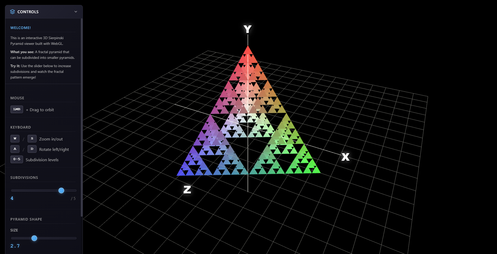

# 3D Sierpinski Pyramid WebGL Viewer

An interactive 3D Sierpinski Pyramid (Tetrahedron) fractal visualizer built with WebGL and JavaScript. This project allows you to explore, subdivide, and manipulate a fractal pyramid in real time, with smooth camera controls and visual effects.



## Features

- Real-time 3D rendering using WebGL
- Adjustable subdivision levels (0–5) for fractal detail
- Interactive camera controls (orbit, zoom, pan)
- Customizable pyramid shape (size and stretch in X, Y, Z)
- Toggleable coordinate axes and grid
- Visual effects: color controls, contrast, and more
- Responsive UI with sliders and checkboxes
- Keyboard and mouse shortcuts for fast navigation

## Controls

### Mouse
- Left Mouse Button + Drag: Orbit camera around the pyramid

### Keyboard
- W / S: Zoom in/out
- A / D: Rotate left/right
- 0–5: Set subdivision level

### UI Panel
- Use the sliders to adjust subdivision, size, and stretch
- Toggle coordinate axes and grid with checkboxes

## Getting Started

1. Clone or download this repository
2. Open `index.html` in your web browser (no build step required)
3. Enjoy exploring the 3D Sierpinski Pyramid!

> Note: For best performance, use a modern browser with WebGL support (Chrome, Firefox, Edge, Safari).

## Project Structure

```
index.html                # Main HTML file (loads shaders, UI, and scripts)
js/
├── app.js                # Application initialization and UI controls setup
├── camera.js             # Camera system: orbit, zoom, and view matrix logic
├── canvas.js             # Canvas creation and resizing logic
├── coordinate-system.js  # Coordinate axes and grid geometry generation and label updates
├── geometry-utils.js     # Geometry utility functions (midpoint, normals, etc.)
├── globals.js            # Global variables and state (WebGL context, buffers, camera, etc.)
├── input.js              # Keyboard and mouse input handlers
├── main.js               # Main entry point: loads all JS modules in order
├── pyramid.js            # Pyramid geometry generation, subdivision, and buffer creation
├── rendering.js          # Main rendering loop and drawing logic
├── shaders.js            # Shader loading, compiling, and program setup
├── visual-effects.js     # Color and visual effects transformations
├── webgl-init.js         # WebGL context initialization
css/                      # CSS styles for UI and effects
img/                      # Images and screenshots
```

## Dependencies
- [glMatrix](https://glmatrix.net/) (for matrix/vector math, loaded via CDN)
- No build tools or frameworks required

## License

This project is open source and available under the MIT License.

## Author

Created by Rakesh Chotaliya

---

Enjoy exploring fractals in 3D!
